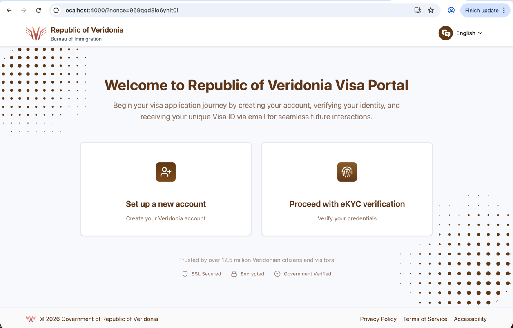
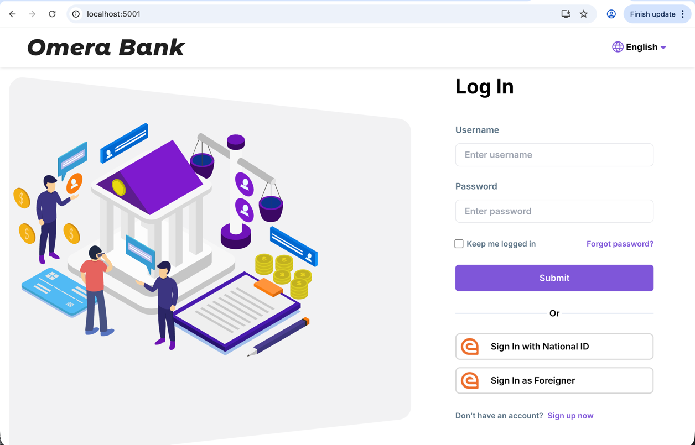

# 🌍Immigration System Use Case 

The Story of Loid Forger: From Westalis to Veridonia

**The Journey Begins**

Loid Forger, a professional from the nation of Westalis, has just been granted a long-term work assignment in the neighboring country of Veridonia. 
To facilitate his relocation, Loid must first register with the Veridonia Immigration System to secure his residency visa and digital identity.

**Phase 1: Digital Onboarding**

Upon arriving at the digital gateway of Veridonia, Loid uses the eSignet-signup portal. He verifies his Westalian email 
address and creates a secure account, uploading his passport details and a live photo. This creates his "Foreigner Profile" 
within the Veridonia national ecosystem.

**Phase 2: The Identity Trust Gap**

To activate his full residency rights, Loid performs an initial identity check using the Westalis NID Verifier. While this 
confirms who he is to the Immigration Department, it is a "standard" level of assurance.

**Phase 3: Accessing Local Services**

A week later, Loid needs to open a local bank account at Omera Banking to receive his salary. In the modern, interoperable 
world of Veridonia, he doesn't need to fill out new paperwork. Instead, he clicks "Login as Foreigner" at the bank.

However, Veridonia’s banking regulations are strict. Omera Banking requires identity verification that meets the eIDAS 
(High Assurance) trust framework. Since Loid’s previous "Westalis NID" check doesn't meet this specific international banking standard,
the system intelligently recognizes the "Trust Gap."

Loid is seamlessly prompted to perform a one-time Video Verification to upgrade his status. Once completed, his identity is 
not only verified for immigration but is now "Bank-Ready," allowing him to open his account in seconds.

---

## Immigration System Setup using eSignet and eSignet-signup

This use case demonstrates how the **Veridonia Immigration System** utilizes **eSignet** for secure user registration 
and identity verification, following the **OpenID Connect for Identity Assurance 1.0** specification.

### 1. User Account Creation
Signup in the immigration system is handled by `esignet-signup`, which manages the initial user onboarding.



**Steps to Register:**
1. Navigate to the signup portal: `http://localhost:4000/`.
2. Click the **Signup** button.
3. Enter an **email address** to initiate OTP verification.
4. Enter `111111` as the OTP to verify the email.
5. Fill in the required profile information:
    * **Username**
    * **Email** (Auto-filled)
    * **Passport Number**
    * **Photo**
6. Submit the form to create the account in the **Veridonia Immigration System**.

> **Note:** The email address must be unique and not already registered in the system.

---

### 2. Identity Verification Process
Once the account is created, the user must undergo identity verification to elevate their trust level.

1. Click **Proceed with Identity Verification**, which redirects to the eSignet login page.
2. **eSignet** handles the authentication to ensure only the account owner can access the verification features.
3. Login using the registered email and the mock OTP `111111`.
4. After successful login, you are redirected to the **Identity Verification** page.

**Verification Workflow:**
* Choose **"Westalis NID Verifier"** as the identity verifier.
* Click **Proceed**.
* In this demonstration, we use a **"Mock Video Verification"** process.
    * *Real-world scenario:* This would involve capturing and analyzing live video footage to verify the user's identity.
* Upon completion, the **verified claims** are stored within the Veridonia Immigration System.

---

### 3. Relying Party Integration (Omera Bank)
This section demonstrates how the **Identity Assurance 1.0 Spec** allows Relying Parties (RPs) to request specific verified 
claims within the OIDC protocol.

We will attempt to access **Omera Banking** as a foreigner, a service that requires high-assurance identity data.

1. Navigate to : `http://localhost:5001/` and click **"Login as Foreigner"**.
2. This triggers an OIDC authorization request to eSignet with specific claims requirements.
3. Enter the same email and OTP to authenticate with eSignet.
4. eSignet identifies the "Trust Gap" due to the mismatch between the initial verification method (Westalis NID) and the RP's requirement (eIDAS).
5. Complete the additional verification step (eIDAS-compliant) to satisfy the RP's requirements.
6. Upon successful verification, within 5 seconds user will be redirected to eSignet consent screen.
7. Consent screen displays the claims being shared with Omera Banking, including "name" and "country" verified under the eIDAS framework.
8. Upon successful authorization, user is redirected back to Omera Banking with access to the requested claims.
9. Omera Banking receives the verified claims and grants access to the user based on the high-assurance identity data.
10. The user can now access banking services that require verified identity information, such as opening an account or applying for a loan.



**The Authorization Request:**
Clicking "Login as Foreigner" triggers a redirect to eSignet with a specific `claims` parameter in the URL:

`http://localhost:3000/authorize?scope=openid%20email&claims=%7B%22userinfo%22:%7B%22verified_claims%22:%7B%22verification%22:%7B%22trust_framework%22:%7B%22value%22:%22eidas%22%7D%7D,%22claims%22:%7B%22name%22:%7B%22essential%22:true%7D,%22country%22:%7B%22essential%22:true%7D%7D%7D%7D%7D...`

**Decoded Claims Structure:**
```json
{
  "userinfo": {
    "verified_claims": {
      "verification": {
        "trust_framework": {
          "value": "eidas"
        }
      },
      "claims": {
        "name": { "essential": true },
        "country": { "essential": true }
      }
    }
  }
}
```

**Key Observation:**
The client (Omera Banking) is requesting "name" and "country" claims specifically verified under the **eIDAS** trust framework.

**Trust Framework Gap Analysis:**
Because the user initially verified their identity using the **"Westalis NID Verifier"** (which is not part of the eIDAS framework), 
the system detects a mismatch. The user will be prompted to undergo the verification process again with an **eIDAS-compliant verifier**
to satisfy the Relying Party's requirements.

**Finalization:**
Once the eIDAS-compliant verification is successful, the user provides consent. They are then redirected back to Omera Banking 
with an authorization code, which the bank exchanges for an access token to retrieve the verified claims.